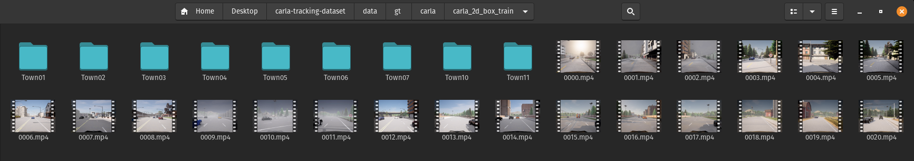

# Carla Tracking Dataset

> A 2D trakcking dataset generated from CARLA simulator with sensors identical to the KITTI dataset.

    data/
    └── gt
        └── carla
            └── carla_2d_box_train
                ├── Town01
                │   ├── image
                │   └── label
                ├── Town02
                │   ├── image
                │   └── label
                ├── Town03
                │   ├── image
                │   └── label
                ├── Town04
                │   ├── image
                │   └── label
                ├── Town05
                │   ├── image
                │   └── label
                ├── Town06
                │   ├── image
                │   └── label
                ├── Town07
                │   ├── image
                │   └── label
                ├── Town10
                │   ├── image
                │   └── label
                └── Town11
                    ├── image
                    └── label

